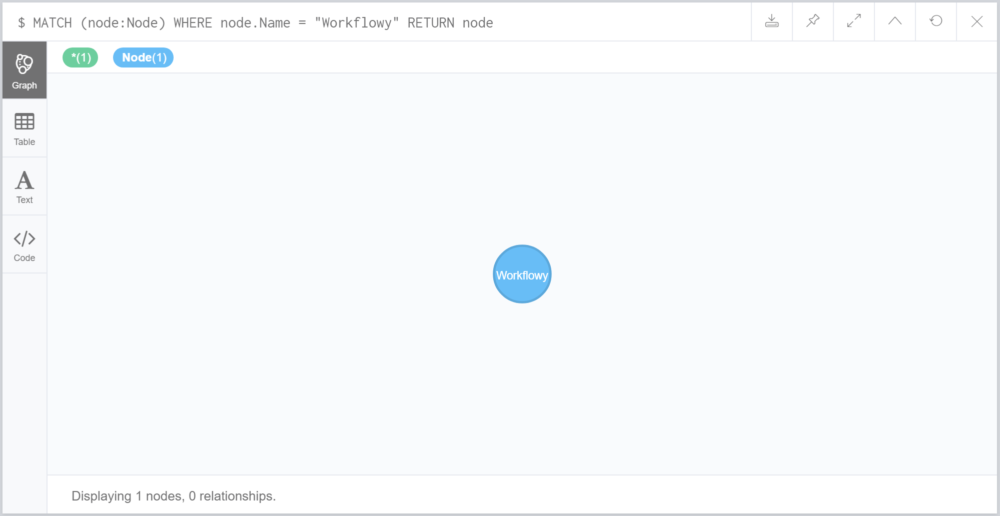
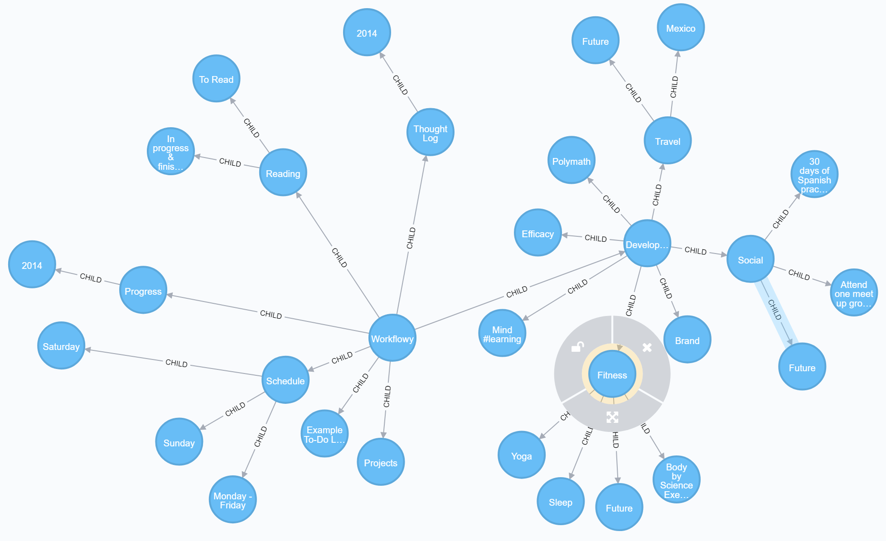

I'm a heavy user of [Workflowy](https://workflowy.com/), which is an amazing tool for taking notes. The structure of the notes is *very* hierarchical. It's pretty much a mind map using nested bullets points which you can drill down into.

I had a random idea that it would make quite an interesting visualization to be able to dump an entire Workflowy account into a [Neo4j](https://neo4j.com/) graph database.

So I span up Neo4j in a local Docker container, and wrote a [LINQPad](https://www.linqpad.net/) script which parses an exported Workflowy data file, and dumps each node into the Neo4j database.

Unfortunately I can't share my Workflowy database - as it contains personal / business information. However, I have included a simple demo database that Workflowy use in their [live demo](https://workflowy.com/demo/embed/). If you use Workflowy yourself, you can easily use this code and the following steps to visualize your own Workflowy data ...

### Prerequisites

* [Docker](https://www.docker.com/)
* [LINQPad](https://www.linqpad.net/)

### Instructions

* Clone this repo to a folder of your choice.
* In a command prompt, navigate to this repos's folder, and type `docker-compose up`. The first time you do this, it'll need to download the Neo4j image, so will take a bit longer. From then onwards, it'll be much faster.
* Once done, navigate to http://localhost:7474 to view the Neo4j browser.
* You're now required to change the default password. Login with username `neo4j` and password `neo4j`, and when prompted change the password to `blah`. This is the password used in the LINQPad script. It's only local, so doesn't need to be secure.
* In Workflowy, choose `Export All`, select `Plain Text`, then save to a file called `Workflowy.txt` in this repo's folder. Overwriting the demo one that's already in the folder (or you can use this demo version if you don't already have a Workflowy account).
* Run the `Neo4j` LINQPad script found in this repo.
* Once complete, navigate back to the Neo4j browser in your web browser.
* Run the following query ...

```
MATCH (node:Node)
WHERE node.Name = "Workflowy"
RETURN node
```

You'll now see the following ...



Double click on it, and it'll pop out its child nodes. Double click on those to drill in.

Below is a screenshot using a Workflowy database that Workflowy use as an example Workflowy ...



This isn't my data, and I just included it to give an example of how it looks. It's not as fun as browsing your own data though. Also, a screenshot doesn't really do it justice, as the Neo4j browser has really nice animations of the nodes, and you can drag them around. I'm planning on writing a blog post about this, and when I do, I'll include a few animated gifs to show this.
